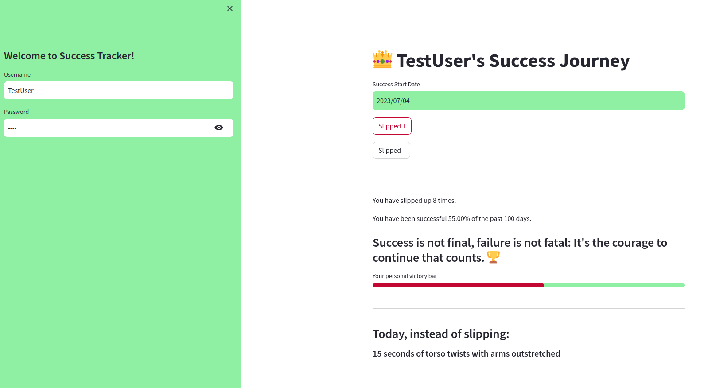
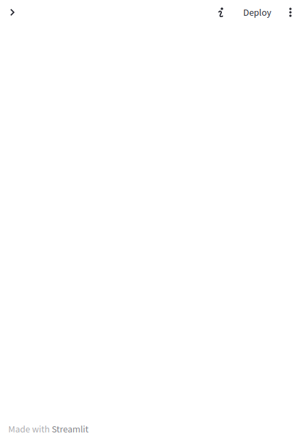

# Success Tracker

A very simple tracker for habit change that allows people to track progress to 
completing a task every day for 100 days in a row.

Uses sqlite3 to store data and streamlit for the UI. The login details for each
user are only stored to allow retrieval of their success data. These are stored
in hashed form and can not be retrieved or reset. This makes it safe and anonymous
to use.

Session values are stored but no cookies are used. This means the user must
log in each time they use the app.

The initial screen may be a little confusing on mobile since the login is in the
side panel which is hidden by default on streamlit. This can be accessed by
clicking the '>' icon in the top left corner.

The user can then enter their login details and click the 'Login' button. 

The database is not set up for a lot of concurrent use, so it is possible that
it will not work sometimes, but come back another time and it should be fine.
